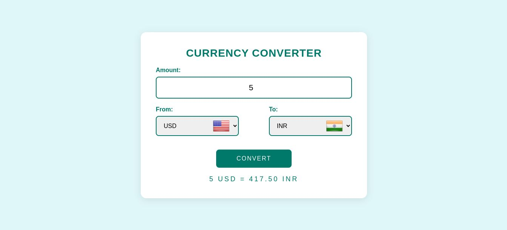

# Currency Converter

A simple currency converter web application that allows users to convert amounts between various currencies. The application fetches real-time currency exchange rates using an API and displays the converted amount. 

## Features

- Convert any amount from one currency to another.
- Real-time currency exchange rates using an API.
- Display flags of selected currencies.
- Responsive design for different screen sizes.

## Technologies Used

- HTML
- CSS
- JavaScript
- API
- JSON

## Live Demo

[Live Demo](https://shivamds15.github.io/Currency-Conversion/)

## Screenshots



### Prerequisites

- A web browser
- Internet connection

### Instructions

1. Clone the repository

2. Navigate to the project directory

3. Open `index.html` in your web browser.

## Usage

1. Enter the amount you wish to convert.
2. Select the currency to convert from.
3. Select the currency to convert to.
4. Click the "CONVERT" button to see the converted amount.

## Project Structure

```plaintext
Currency-Conversion/
│
├── index.html        # The main HTML file
├── style.css         # The main CSS file
├── countrylist.js    # JavaScript file containing currency and country codes
├── script.js         # Main JavaScript file for the currency converter logic
└── README.md         # This README file
```

## Code Explanation

### HTML

The `index.html` file contains the structure of the currency converter interface.

### CSS

The `style.css` file contains styles to make the application visually appealing.

### JavaScript

The `countrylist.js` file contains the list of currency codes and corresponding country codes.
The `script.js` file contains the logic for fetching currency exchange rates, handling user inputs, and updating the UI.

### API and JSON

The application uses a real-time currency exchange rate API from [Currency API](https://cdn.jsdelivr.net/gh/ismartcoding/currency-api@main/latest/data.json) which provides the exchange rates in JSON format.

## Contributing

Contributions are welcome! Please open an issue or submit a pull request.

## License

This project is licensed under the MIT License.
